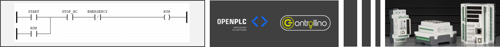
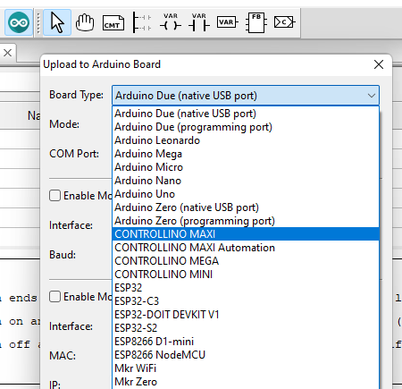

# ❗Excellent news❗

## A tool to program your CONTROLLINO using IEC 61131-3 PLC programing languages  🤩🦾🚀



_[OpenPLC Project](https://openplcproject.com/)_, in the latest version of its IEC 61131-3 Editor, introduced the functionality to directly programming Arduino boards, and we have recently added support for our CONTROLLINOs. We remain committed to Open Source, and we believe that this tool will make it easy for our user community to develop automation solutions with an experience like what they are used to see in more traditional PLC development environments.

---

## Table of Contents

- [❗Excellent news❗](#excellent-news)
  - [A tool to program your CONTROLLINO using IEC 61131-3 PLC programing languages  🤩🦾🚀](#a-tool-to-program-your-controllino-using-iec-61131-3-plc-programing-languages--)
  - [Table of Contents](#table-of-contents)
  - [Advantages of using OpenPLC Editor with CONTROLLINO](#advantages-of-using-openplc-editor-with-controllino)
  - [OpenPLC Editor download, installation and update to include CONTROLLINO boards support](#openplc-editor-download-installation-and-update-to-include-controllino-boards-support)
    - [Download and install](#download-and-install)
    - [Check for updates to include CONTROLLINO boards support](#check-for-updates-to-include-controllino-boards-support)
  - [Awesome examples based on common real life automation systems](#awesome-examples-based-on-common-real-life-automation-systems)
    - [Example list](#example-list)
    - [How to get and open examples](#how-to-get-and-open-examples)
  - [CONTROLLINO pinout definitions for OpenPLC integration](#controllino-pinout-definitions-for-openplc-integration)
    - [CONTROLLINO MINI](#controllino-mini)
    - [CONTROLLINO MAXI](#controllino-maxi)
    - [CONTROLLINO MAXI Automation](#controllino-maxi-automation)
    - [CONTROLLINO MEGA](#controllino-mega)
  - [Support Info](#support-info)

---

## Advantages of using OpenPLC Editor with CONTROLLINO

- Nice and mature IDE for IEC 61131-3 programing (Ladder, ST, IL, FBD and SFC). `!!! HOW GOOD SOUNDS THAT !!!` 🤗

- Simulation engine: You can simulate your program before uploaded to the CONTROLLINO. `!!! OMG REALLY !!!` 🤩

- Modbus RTU, Serial and TCP/IP: In our boards support we included the possibility of using the RS485 in our MAXI and MEGA families. `!!! YES IT'S TRUE !!!` 🚀

---

## OpenPLC Editor download, installation and update to include CONTROLLINO boards support

### Download and install

- Go to [OpenPLC download page](https://openplcproject.com/download/) and get the Editor according to your OS.
- After download just follow the normal installation process.

### Check for updates to include CONTROLLINO boards support

- After open for the first time go to File -> Check for updates...
- If there are any updates avialable acept them and `then restart OpenPLC Editor to apply the updates`.

 

- After update should be possible to select our boards in the Arduino upload dialog.



Maybe in the moment you are seen this tutorial CONTROLLINO boards support is already included with the default install  but any way is always a good practice to check for updates ;)

## Awesome examples based on common real life automation systems

We have prepared for you some real-life automation examples that are easy to put to work, will be useful for understanding how OpenPLC Editor works with CONTROLLINO, and maybe are the solution you want to build with a CONTROLLINO.

These tutorials are easy to test using the [CONTROLLINO Training Kit](https://www.controllino.com/product/controllino-training-kit/), so feel free to order if you want a faster learning and testing experience.

Please follow the links in the example names for more complete example documentation inside each example REDAME file.

### Example list

- [Stairs Lights Automation](./stairs_light_control): Stairs with three lights bottom, middle and top, for controlling there are two push button switches in the bottom and the top that will turn on and off the lights and there is also and presence sensor...

- [Pump and Tank Automation](./water_control): There is a pump to fill a tank that has two digital level sensors for high and low level, this pump is handled using a external contactor that also has a thermomagnetic protection, there is also lots of pilot indicators to signal each state...

- Soon we will add with the help of the community we will add other classic PLC automation examples like Elevator and Traffic Lights.

 

### How to get and open examples

- Install git and clone the examples repository.

```bash
git clone https://github.com/CONTROLLINO-PLC/OpenPLC_examples.git
```

- Hit "Open" folder in the Editor interface and select the example folder you want to open.

 

## CONTROLLINO pinout definitions for OpenPLC integration

### CONTROLLINO MINI

```cpp
/************************PINOUT CONFIGURATION*************************
Digital In:  A2, A3, A6, A7, IN0, IN1                   (%IX0.0 - %IX0.5)

Digital Out: D0, D3, D4, D5, D6, D7                     (%QX0.0 - %QX0.5)

Analog In:   A0, A1                                     (%IW0 - %IW1)

Analog Out:  D1, D2                                     (%QW0 - %QW1)
*********************************************************************/
```

### CONTROLLINO MAXI

```cpp
/************************PINOUT CONFIGURATION*************************
Digital In:  A4, A5, A6, A7, A8, A9, IN0, IN1           (%IX0.0 - %IX0.7)

Digital Out: D4, D5, D6, D7, D8, D9, D10, D11           (%QX0.0 - %QX0.7)
             R0, R1, R2, R3, R4, R5, R6, R7             (%QX1.0 - %QX1.7)
             R8, R9                                     (%QX2.0 - %QX2.1)

Analog In:   A0, A1, A2, A3                             (%IW0 - %IW3)

Analog Out:  D0, D1, D2, D3                             (%QW0 - %QW3)
*********************************************************************/
```

### CONTROLLINO MAXI Automation

```cpp
/************************PINOUT CONFIGURATION*************************
Digital In:  AI2, AI3, AI4, AI5, AI6, AI7, AI8, AI9     (%IX0.0 - %IX0.7)
             AI10, AI11, DI0, DI1, DI2, DI3, IN0, IN1   (%IX1.0 - %IX1.7)

Digital Out: DO0, DO1, DO2, DO3, DO4, DO5, DO6, DO7     (%QX0.0 - %QX0.7)
             R0, R1, R2, R3, R4, R5, R6, R7             (%QX1.0 - %QX1.7)
             R8, R9                                     (%QX2.0 - %QX2.1)

Analog In:   AI0, AI1, AI13, AI13                       (%IW0 - %IW3)

Analog Out:  AO0, AO1                                   (%QW0 - %QW1)
*********************************************************************/
```

### CONTROLLINO MEGA

```cpp
/************************PINOUT CONFIGURATION*************************
Digital In:  A5, A6, A7, A8, A9, A10, A11, A12          (%IX0.0 - %IX0.7)
             A13, A14, A15, I16, I17, I18, IN0, IN1     (%IX1.0 - %IX1.7)

Digital Out: D12, D13, D14, D15, D16, D17, D18, D19     (%QX0.0 - %QX0.7)
             R0, R1, R2, R3, R4, R5, R6, R7             (%QX1.0 - %QX1.7)
             R8, R9, R10, R11, R12, R13, R14, R15       (%QX2.0 - %QX2.7)

Analog In:   A0, A1, A2, A3, A4                         (%IW0 - %IW4)

Analog Out:  D0, D1, D2, D3, D4, D5, D6, D7             (%QW0 - %QW7)
             D8, D9, D10, D11                           (%QW8 - %QW11)
*********************************************************************/
```

### CONTROLLINO MICRO

```cpp
/*********PINOUT CONFIGURATION********
Digital In:  DI0, DI1, DI2, DI3                         (%IX0.0 - %IX0.3)
Digital Out: DO0, DO1, DO2, DO3, DO4, DO5               (%QX0.0 - %QX0.5)
Analog In:   AI0, AI1, AI2, AI3, AI4, AI5               (%IW0 - %IW5)
Analog Out:  DO6, DO7                                   (%QW0 - %QW1)
***********************/
```

## Support Info

Everybody is free to make pull requests to add more examples and also you can write us at techsupport@controllino.com and we will be very happy to answer any doubts you may have.

For additional info and docs on OpenPLC Editor please visit [OpenPLC Project Website](https://openplcproject.com/) and [OpenPLC Project Forum](https://openplc.discussion.community/).
