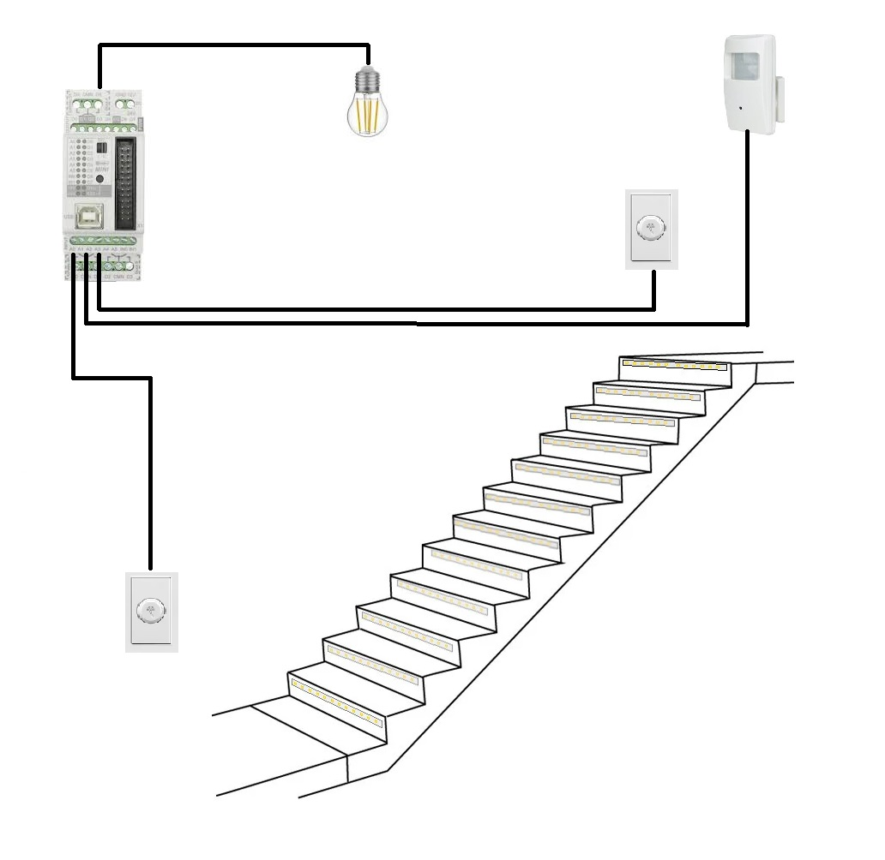

# Staircase Light Control System

## Overview

This project demonstrates an automatic control system for a staircase lighting system. The system uses two push buttons (one at the top of the stairs and one at the bottom) and a Passive Infrared (PIR) sensor to control a light. The light can be toggled manually using the buttons or activated automatically when the PIR sensor detects motion. The light stays on for a predefined duration when triggered by the PIR sensor.

The control logic is programmed using OpenPLC software, as illustrated in the provided ladder diagram. This code can be deployed on any CONTROLLINO model or compatible PLC, provided the input and output connections match the assigned variable names in the PLC program.

## System Behavior

1. **Manual Control with Buttons**:
   - The staircase light can be toggled on or off by pressing either the **upstairs** or **downstairs** button.
   - Pressing a button changes the state of the light (from off to on or from on to off).

2. **Automatic Activation via PIR Sensor**:
   - The PIR sensor detects motion on the stairs and automatically turns on the light.
   - Once triggered, the light remains on for 20 seconds and then turns off if no further motion is detected.

## Configuration

This project can be tested with the CONTROLLINO Training Kit or any CONTROLLINO model by configuring the input and output pins as described below.

### Pinout

#### Outputs

- **DO0** -> `%QX0.0` -> `stairs_light`  
  Controls the staircase light. A high signal turns the light on.

#### Inputs

- **DI0** -> `%IX0.0` -> `stairs_pir_sensor`  
  Input from the PIR sensor. A high signal indicates motion detection.

- **DI1** -> `%IX0.1` -> `control_button_down`  
  Input from the downstairs push button.

- **DI2** -> `%IX0.2` -> `control_button_up`  
  Input from the upstairs push button.

#### Timers

- **TOF0** -> `TOF` -> Timer for the light activation duration.  
  Set to 20 seconds (T#20s) to control the light timeout after motion is detected.

## Ladder Logic Explanation

The ladder diagram below (refer to the attached image) shows the control logic programmed in OpenPLC for this system:

- **Manual Light Control**:
  - Pressing the `control_button_up` or `control_button_down` toggles the `lights_buttons_state`.
  - The `lights_buttons_state` is used to set or reset the output `stairs_light`.

- **Automatic Light Control**:
  - When the `stairs_pir_sensor` detects motion, the timer `TOF0` is triggered.
  - The light is turned on (`stairs_light` is set) as long as the timer is active or motion is detected.

- **Light Timeout**:
  - The timer `TOF0` deactivates the light after 20 seconds of no motion.
  - The `stairs_light` is reset when `TOF0` completes or `lights_buttons_state` is turned off manually.

This setup provides flexibility by combining manual control via buttons and automatic activation based on motion detection.

## How to Run

1. **Install OpenPLC**: Follow the instructions in the main README to set up and open this example in the OpenPLC Editor.
2. **Load to CONTROLLINO**: Connect the appropriate inputs and outputs on your CONTROLLINO device as per the configuration table above.
3. **Test the System**:
   - Test manual toggling of the light using the upstairs and downstairs buttons.
   - Walk near the PIR sensor to trigger automatic light activation and observe the 20-second timer behavior.
